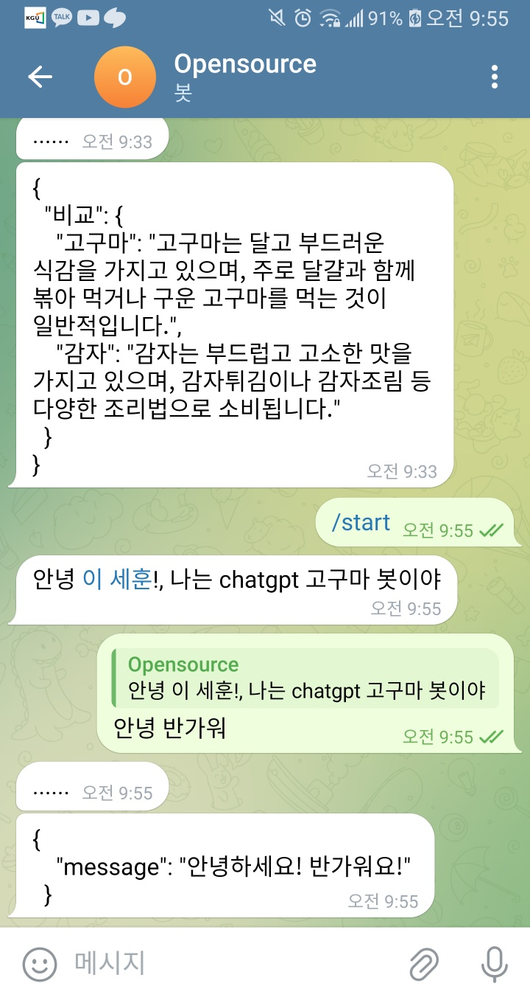

# 텔레그램 CHATBOT 과제 3번 오픈소스 201911977_이세훈😿

질문에 대한 chatbot의 답변을 json format으로 받기 대 성 공!
# 성공 사진1

인사하는 CHATBOT 사진

# 성공 사진2

질문에 답해주는 CHATBOT 사진

## 실행 방법 (python=3.7.16)
1. 레포지토리 복제해주세요

2. 설치해주세요
   ```bash
   pip3 install -r requirements.txt
   ```
3. tele.py에서 자신의 텔레그램 토큰을 수정해주세요

4. callgpt4.py에서 자신의 OPEN-API-KEY를 넣어주세요

5. TELEGRAM에 /start를 쳐서 chatbot을 활성화 시키고 질문을 해보세요!